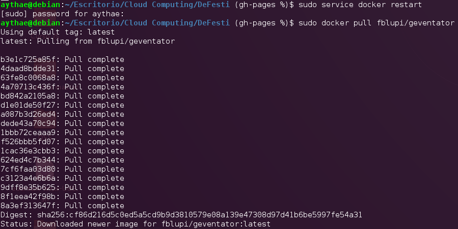
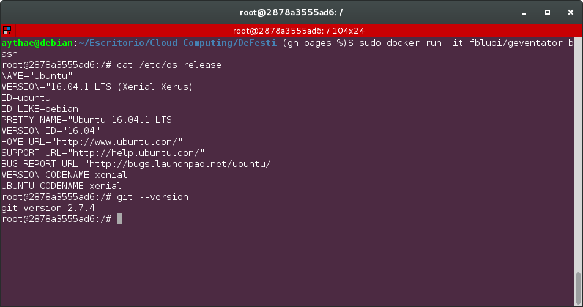

# Corrección de contenedores de otros compañeros

## [@flupi](https://github.com/fblupi)

[Enlace al issue](https://github.com/fblupi/GEventator/issues/23#issuecomment-269510361)

Volver a la [página principal](index).
